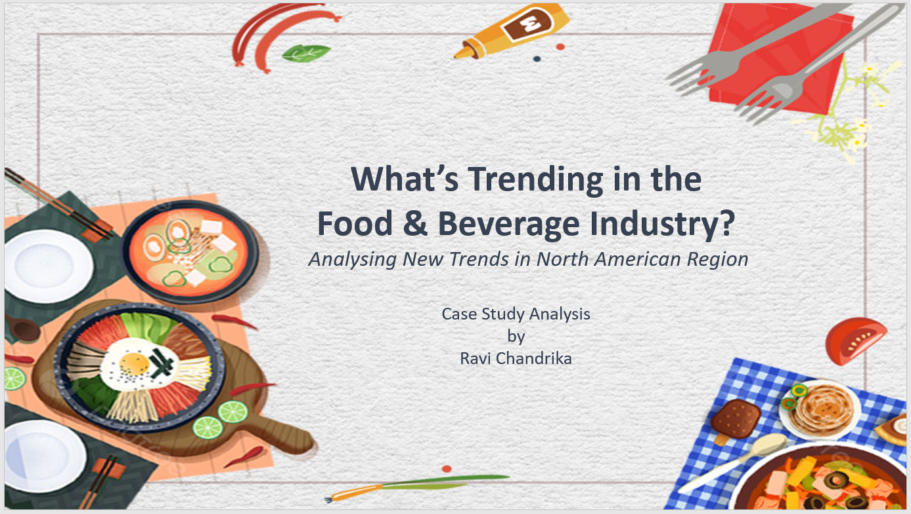

# Whats Trending in the  Food & Beverage Industry?

 "Conducting a comprehensive evaluation of the North American food and beverage industry, analyzing market trends, emerging flavors, and consumer preferences to provide a holistic understanding of the regional F&B landscape."

 ## Project Goal:

The current data set provides comprehensive information on new Food and Beverage (F&B) product launches globally, encompassing details such as product attributes, flavors, launch dates, and positioning categories. However, a challenge lies in extracting meaningful insights, particularly with regard to F&B flavors in the North America region.

The goal of this assignment is to derive actionable insights, particularly focusing on the North America region, to assist stakeholders in making informed decisions regarding F&B product launches and flavor preferences.

In addition to this as a As the Brand Manager in the Consumer Packaged Goods (CPG) - Foods business, for any Market-category, determining whether to launch a new brand variant involves a strategic decision-making process. The outcome of this analysis will impact the product portfolio, market positioning, and overall brand performance. 

## Key Takeaway

### Trend in New Product Introductions:
New product launches have consistently increased over the years, with a notable surge in 2009 and a slight dip in 2007.

### Market Focus and Expansion:
The primary market focus has been on the USA, with limited launches in Canada. However, there was a significant increase in product additions to the Canadian market in 2007 and 2009.

### Global Expansion:
Mexico entered the market in 2008, showcasing the expansion of product entries into new regions.

### Consumer Preferences and Health Trends:
Consumers prioritize convenience and natural, organic, low-calorie options with antioxidants, and no additives or preservatives. This trend aligns with a growing emphasis on passive health benefits.

### Flavor Diversity and Trends:
There is a diverse range of flavors, with a notable preference for plant-based options. Fruit and botanical flavors, including Orange and Pomegranate, have gained popularity.

### Market Share and Category Insights:
Juice and juice drinks dominate the market share at 36.18%, followed by drink concentrates and mixes at 18.4%, and Iced tea at 10.41%. Carbonates, bottled water, and energy drinks collectively account for 25% of the market.

### Iced Tea Category Trends:
Green tea, lemon tea, white tea, and black tea remain popular in the iced tea category. Peach-flavored tea gained traction from 2006 onwards.

### Flavor Variation and Market Position:
Between 2001-2010, there are flavors associated with only one product, indicating diversity. Iced tea holds a significant market position with a 10.41% share.

### Spice and Flavor Popularity:
Traditional spices like ginger, cinnamon, cardamom, and lemongrass maintain popularity. Wasabi has surged in the last five years, and turmeric has gained traction since 2008.

### Trend in New Product Introductions Over Time:
The percentage of new product introductions has varied over the years, experiencing peaks and troughs. This reflects the dynamic nature of the market and consumer preferences.

## Overview

The attached data provides insights into global Food and Beverage (F&B) product launches.
Explore details in:
Product Launch Dataset.csv
Each product may have multiple flavors separated by a semicolon.
"Launch date" indicates the product launch date.
Flavor Classification Dataset.csv
Maps unique flavors to "Flavor Groups."
Positioning Category Mapping Dataset.csv
Maps unique positioning categories to "Positioning Groups."

## Data Cleaning and Dataset Creation Approach in Python:

### Filtering data for north-america region:
* The scope of this exercise involves analysis for North American region only. Hence I have filtered the data for North America region before performing any necessary data manipulations to create our analytical datasets, to reduce our computational inputs and outputs.

### Creating a product flavor group:
* Explode the "Flavor" column in product data, which has multiple flavors seperated by ; into individual rows, with one flavor per row.
* Convert "Flavor" column in product data to lower case and strip any extra whitespace
* Convert "Flavor" column in flavor data to lower case and strip any extra whitespace

### Dataset Export:
Saved the cleaned dataset for further analysis, ensuring it's ready for Power BI.

## Assumptions for the Project:
### Role of Flavor:
Assumption: The popularity of a flavor is directly correlated with its sales performance. 

Rationale:  The consumers' preferences and purchasing decisions are driven by the flavors of F&B products.
 
### Country assumption:
Assumption: NA region comprises countries as the USA (NA1), Canada (NA2), and Mexico (NA3).
 
### Sales Data Proxy: 
Assumption: The number of distinct products launched is a proxy for sales data.

Rationale: Assuming that the addition of new products signifies successful flavors and potential sales growth.
 
### Launch Date Impact:
Assumption: Recent product launches are more reflective of current market trends.

Rationale: Giving more weight to products launched in the last 5 years to identify emerging flavors.
 
### roduct Launch Frequency:
Assumption: Higher product launch frequency indicates a dynamic market.

Rationale: Frequent launches may indicate a competitive market where innovation and variety are crucial.
 
### Brand Loyalty:
Assumption: Existing SKUs may have established brand loyalty.

Rationale: Recognizing that retaining existing products might be beneficial if they have a loyal customer base.
 
### Market Saturation:
Assumption: Market saturation may lead to SKU removal decisions.

Rationale: Evaluating whether the market is saturated with similar products and if removing certain SKUs could streamline the product line.

## Business ideas and SKUs

### Immunity Boost Iced Tea (SKU):
Infuse iced tea with natural ingredients known for immune support with a hit of vitamin C. Capitalize on the growing consumer mood towards health-conscious beverages.

### Global Fusion Flavors Pack (SKU):
Introduce a variety pack of iced teas featuring unique global flavors inspired by Italian, Chinese, and Japanese culinary influences. We can offer flavors like Italian Lemon Twist, Chinese Green Jasmine, Japanese Cherry Blossom and Masala Chai.

### Eco-Friendly and Sustainable packaging:
Launch an eco-friendly line of iced teas packaged in sustainable materials with regenerative and upcycled labelling. Appeal to environmentally conscious consumers seeking ethically sourced beverages.

### Exotic Spice Infusion Iced Tea (SKU):
Create a line of iced teas infused with exotic spices like ginger, cinnamon, cardamom, and lemongrass. Offer a unique and flavourful experience for consumers looking for a departure from traditional tea options.

### Tropical Paradise Hydration Pack (SKU):
Develop a iced tea line featuring tropical flavors, herbs, and botanicals sourced from different parts of the world. Cater to consumers seeking low-calorie, natural, and refreshing fruity options.

### Customizable DIY Iced Tea Kits (SKU):
Offering Do-It-Yourself (DIY) iced tea kits. Provide a range of base teas and flavor enhancers, allowing customers to create their personalized iced tea blends at home.

# Power BI Dashboard

[( Link to Power BI Dashboard)](https://app.powerbi.com/view?r=eyJrIjoiNGNmMGRmZGQtNDRhZi00MTQwLWIzNDQtZTY4MjJkYmJiNDE1IiwidCI6ImRmODY3OWNkLWE4MGUtNDVkOC05OWFjLWM4M2VkN2ZmOTVhMCJ9)

